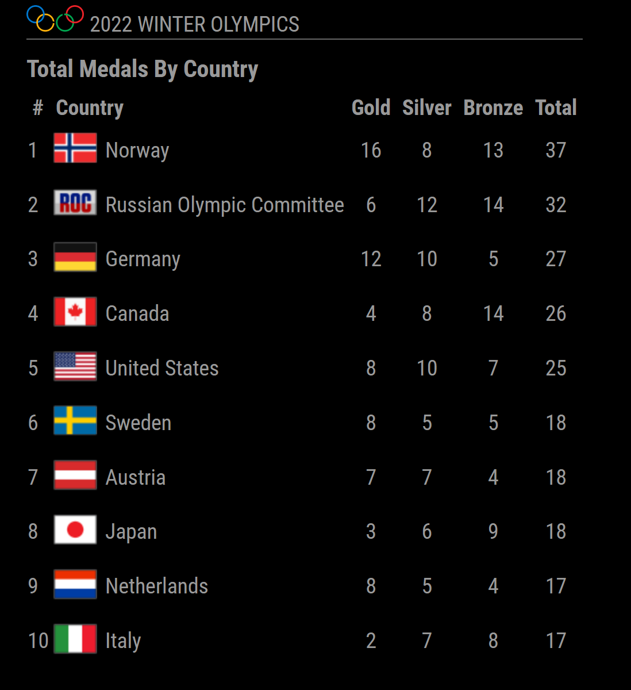
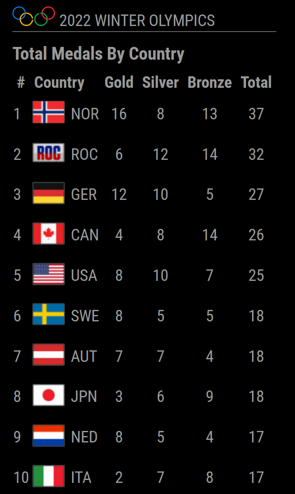
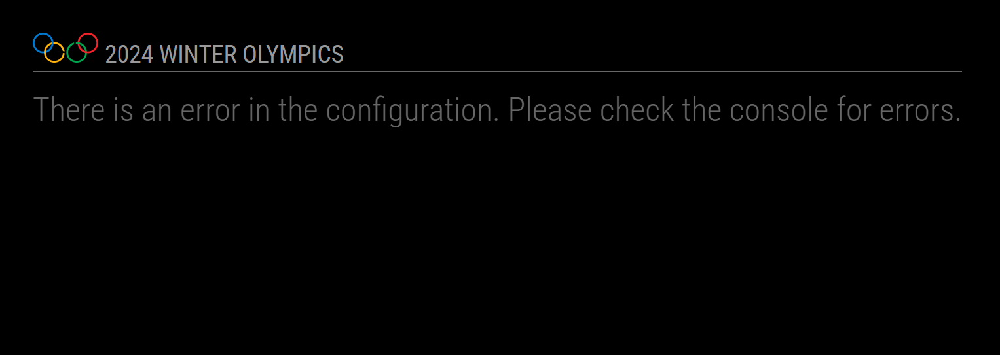
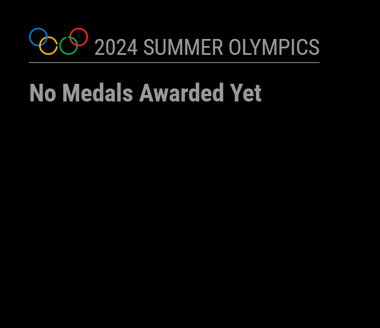

# MMM-OLYMPIC-MEDALS
Olympic Medals Module for MagicMirror<sup>2</sup>

## Examples

### Olympics with Medals Awarded
 
```
 {
    module: 'MMM-OLYMPIC-MEDALS',
        position: 'top_left',
        config:{
            season: 'winter',
            year: 2022,
            useAbbreviations: false,
        }
 }
```
<hr />

### Using abbreviation instead of country names
 
```
 {
    module: 'MMM-OLYMPIC-MEDALS',
        position: 'top_left',
        config:{
            season: 'winter',
            year: 2022,
            useAbbreviations: true,
        }
 }
```
<hr />

### Invalid configuration
 
```
 {
    module: 'MMM-OLYMPIC-MEDALS',
        position: 'top_left',
        config:{
            season: 'winter',
            year: 2024,
        }
 }
```
<hr />

### No Medals awarded yet

```
 {
    module: 'MMM-OLYMPIC-MEDALS',
        position: 'top_left',
        config:{
            season: 'summer',
            year: 2024,
        }
 }
```

## Dependencies

* An installation of [MagicMirror<sup>2</sup>](https://github.com/MagicMirrorOrg/MagicMirror)
* npm
* [cheerio](https://github.com/cheeriojs/cheerio)

## Installation

1. Clone this repo into `~/MagicMirror/modules` directory.
1. Configure your `~/MagicMirror/config/config.js`:

    ```
    {
        module: 'MMM-OLYMPIC-MEDALS',
        position: 'top_right',
        config: {
            // all your config options, which are different than their default values
        }
    }
    ```

1. Run command `npm install` in `~/MagicMirror/modules/MMM-OLYMPIC-MEDALS` directory.

## Config Options

| **Option** | **Default** | **Description** |
| --- | --- | --- |
| `season` | `'summer'` | `'summer'` or `'winter'` |
| `year` | `2024` | Year to get medais for. Invalid year will throw an error on start. |
| `reloadInterval` | `3600000` (1 hour) | How often should the data be fetched. |
| `tableSize` | `'xsmall'` | Font size of table. Possible values: `'xsmall'`, `'small'`, `'medium'`, `'large'` and `'xlarge'` |
| `numOfRows` | `10` | Max number of countries to show in table. |
| `useAbbreviations` | `false` | Whether to use full country name or 3 character abbreviation. |

## Module Notes

This module screen scapes the ESPN page for medals. If ESPN changes their format of how they display their medal count, this module will need updates.

Currently, only summer and winter olympics are supported with the ESPN url. 